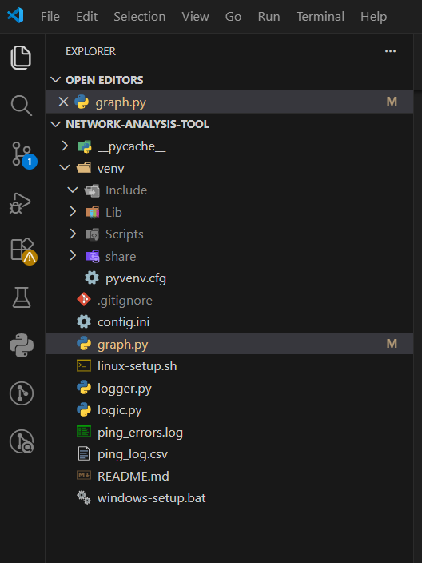
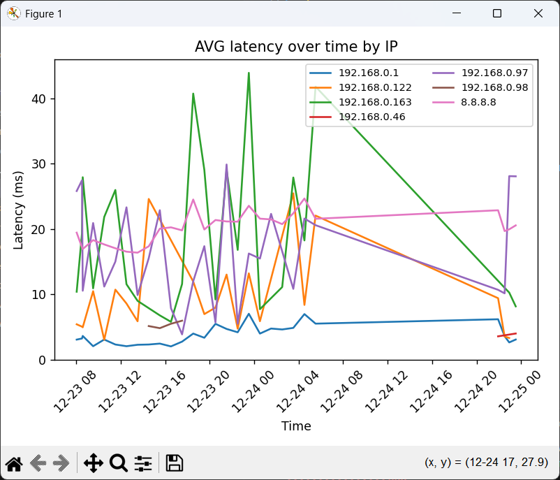

# Network-Analysis-tool
This is a tool that analyzes your network over prolonged periods of time by pinging various IPs in your LAN and on the internet.
## Installation
The installation scripts automatically make use of the task scheduler for windows and cronjobs for linux to run the script every hour, sending and loggind the pings.
Install the dependencies

```
pip install -r requirements.txt
```

<br>
Setup the task or cronjob:
For Windows users: Double-tap the "windows-setup.bat" file.
For Linux users: Run the "linux-setup.sh" script.

### Configuration
Open the config.ini file and change the LAN Devices writing down at least 3 IPs from your network.
optional: you can change any of the IPs like the router or public IP.

## Use 
Run the "graph.py" file to view a graph of the pings' average time over time.

